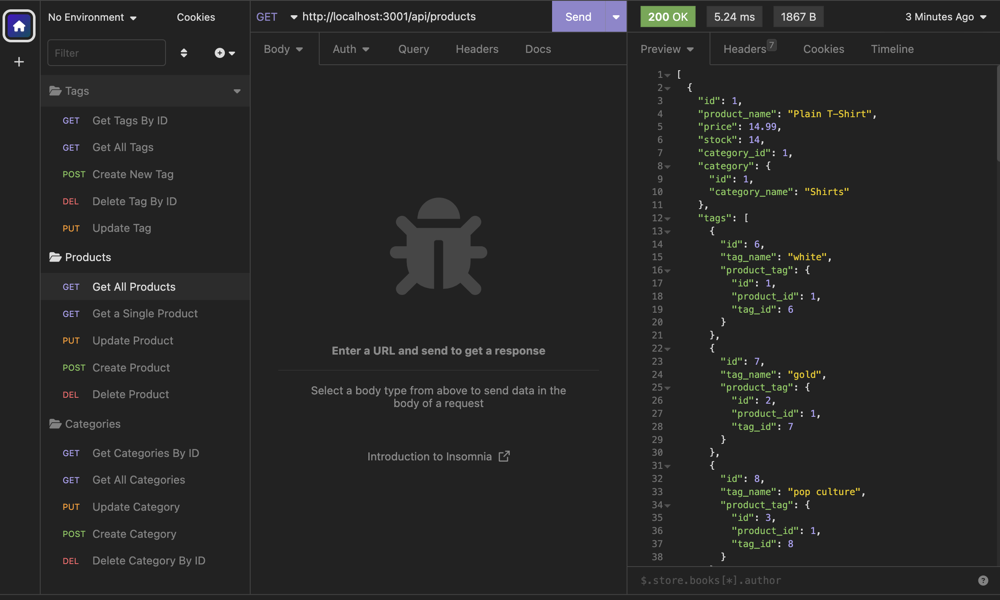

 # Ecommerce Backend (Mockup)

## Table of Contents
- [Description](#description)
- [Video](#video)
- [Visuals](#visuals)

## Description
This is a mock up of the back end of an ecommerce site. Using tools such as node.js, sequelize, mysql, and express.js, the user can run a server in their code editor of choice. Using this server, the user may use a program, such as Insomnia, to submit and recieve requests and JSON information. Once in a code editor and in Insomnia, users may requests all items, or invididual items. Users may also create new items by inputing JSON values.

## Video
[Video](https://youtu.be/A56FILRK6V4)

## Visuals

